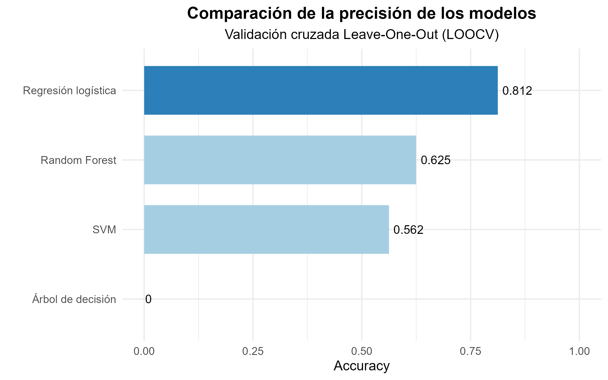
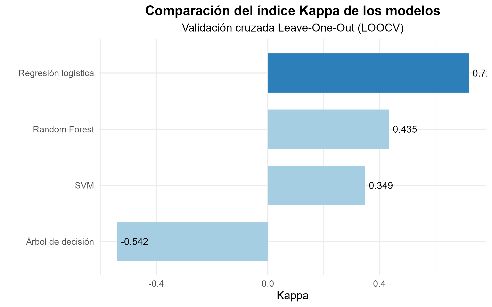
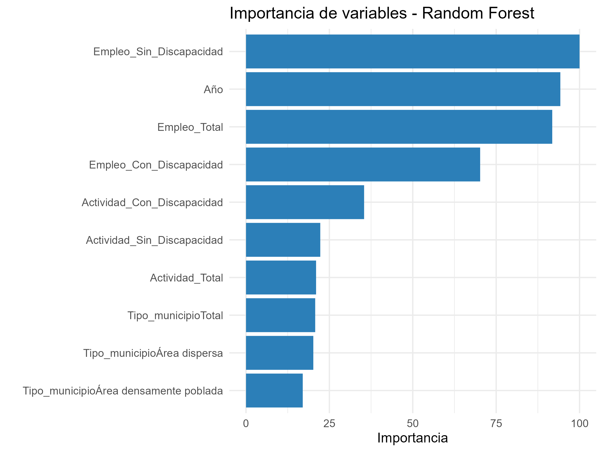

# Machine Learning aplicado al mercado laboral – INE

## Descripción

Proyecto de **Machine Learning aplicado al mercado laboral**, desarrollado en **R y RStudio** a partir de datos del **Instituto Nacional de Estadística (INE)**.

El objetivo es aplicar diferentes técnicas de aprendizaje automático para **clasificar el nivel de desempleo** utilizando variables relacionadas con la actividad y el empleo.

## Objetivos

* Preparar y transformar los datos procedentes del INE.
* Realizar un análisis exploratorio de los datos.
* Aplicar técnicas de preprocesamiento.
* Entrenar diferentes modelos de Machine Learning.
* Comparar el rendimiento de los modelos.
* Analizar la importancia de las variables.
* Representar gráficamente los principales resultados.

## Datos

Los datos utilizados proceden del **Instituto Nacional de Estadística (INE)** y contienen información relacionada con el mercado laboral.

Entre las variables utilizadas se encuentran:

* Actividad total.
* Actividad de personas con discapacidad.
* Actividad de personas sin discapacidad.
* Empleo total.
* Empleo de personas con discapacidad.
* Empleo de personas sin discapacidad.
* Tasa de paro.
* Tipo de municipio.
* Año.

El archivo principal utilizado es:

`data/mercado_laboral_ine.csv`

## Metodología

El proyecto se desarrolla en las siguientes etapas:

1. **Carga de los datos**
2. **Limpieza y transformación**
3. **Análisis exploratorio**
4. **Preprocesamiento**
5. **Preparación de los modelos**
6. **Entrenamiento de modelos de Machine Learning**
7. **Evaluación y comparación**
8. **Visualización de resultados**

## Modelos utilizados

Se entrenaron y compararon cuatro modelos:

* Regresión logística
* Random Forest
* Support Vector Machine (SVM)
* Árbol de decisión

## Resultados

Los modelos se evaluaron mediante las métricas **Accuracy** y **Kappa**.

| Modelo              | Accuracy |   Kappa |
| ------------------- | -------: | ------: |
| Regresión logística |   0.8125 |  0.7209 |
| Random Forest       |   0.6250 |  0.4353 |
| SVM                 |   0.5625 |  0.3488 |
| Árbol de decisión   |   0.0000 | -0.5422 |

Estos resultados corresponden al conjunto de datos utilizado en este proyecto.

### Accuracy



### Kappa



### Importancia de variables

Se analizó también la importancia de las variables utilizadas por el modelo **Random Forest**.



## Estructura del proyecto

```text
ML-Mercado-Laboral-INE/
│
├── README.md
├── ML_Mercado_Laboral_INE.Rproj
│
├── data/
│   └── mercado_laboral_ine.csv
│
├── scripts/
│   ├── 01_carga_datos.R
│   ├── 02_limpieza_datos.R
│   ├── 03_analisis_exploratorio.R
│   ├── 04_preprocesamiento.R
│   ├── 05_preparacion_modelos.R
│   ├── 06_modelos_ml.R
│   ├── 07_evaluacion.R
│   └── 08_graficos.R
│
├── figures/
│   ├── Figura4_Accuracy.png
│   ├── Figura5_Kappa.png
│   └── Figura6_Importancia_RF.png
│
└── output/
    └── resultados_modelos.csv
```

## Tecnologías utilizadas

* **R**
* **RStudio**
* **tidyverse**
* **caret**
* **ggplot2**
* Técnicas de Machine Learning

## Reproducibilidad

El proyecto está organizado mediante scripts independientes que permiten seguir las diferentes fases del análisis.

Para reproducir el proyecto:

1. Descargar o clonar el repositorio.
2. Abrir `ML_Mercado_Laboral_INE.Rproj` en RStudio.
3. Ejecutar los scripts de la carpeta `scripts/` siguiendo su numeración.

## Fuente de los datos

**Instituto Nacional de Estadística (INE).**

## Autor

**Luis Alfonso Jorge Aparicio**

Proyecto académico desarrollado como aplicación práctica de técnicas de análisis de datos y Machine Learning.
